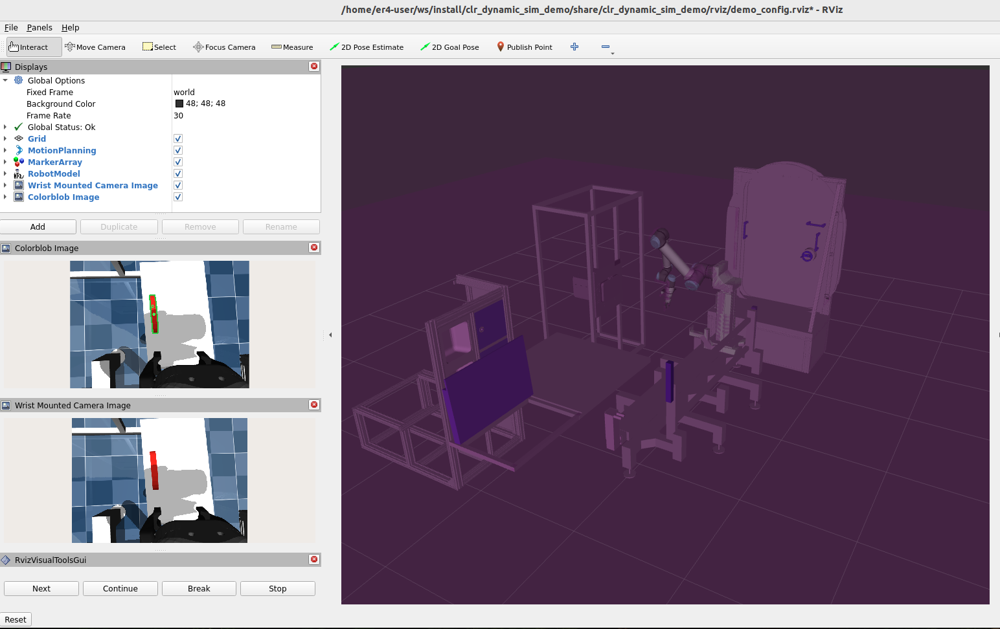

# CLR CTB Grasping Demonstration

This package contains a demonstration of a perception-enabled CTB picking and placing task.

The application has been used to trial a sim-to-real transfer of simulated behaviors using [MuJoCo](https://mujoco.readthedocs.io/en/stable/overview.html).



## Simulation Instructions

To run this demo in simulation, run the following in a dynamic sim container:

```bash
# Start the mujoco ros2 control-based simulation including the environment
ros2 launch clr_mujoco_config clr_mujoco.launch.py

# Launch the moveit group and the demo's planning GUI
ros2 launch clr_dynamic_sim_demo demo_planning_viz.launch.py

# Start the demonstration, the console will display prompts from MoveItVisualTools and provide
# other information.
ros2 launch clr_dynamic_sim_demo demo.launch.py
```

By default, each stage of the demonstration requires operator approval by clicking `next` in the RViz console.
To disable this and just let the simulation run, use (still click `next` to start the sim):

```bash
ros2 launch clr_dynamic_sim_demo demo.launch.py wait_for_prompt:=false
```

## Hardware Instructions

To run this demo on hardware, run the following in a dynamic sim container on the controls PC:

```bash
ros2 launch clr_deploy clr_hw.launch.py include_mockups_in_description:=true

ros2 launch chonkur_deploy ur_tools.launch.py
```

Then run the following in the dynamic sim container on the console PC:

```bash
ros2 launch clr_moveit_config clr_moveit.launch.py launch_rviz:=false include_mockups_in_description:=true

ros2 launch clr_dynamic_sim_demo demo_planning_viz.launch.py sim:=false

ros2 launch clr_dynamic_sim_demo demo.launch.py sim:=false
```
