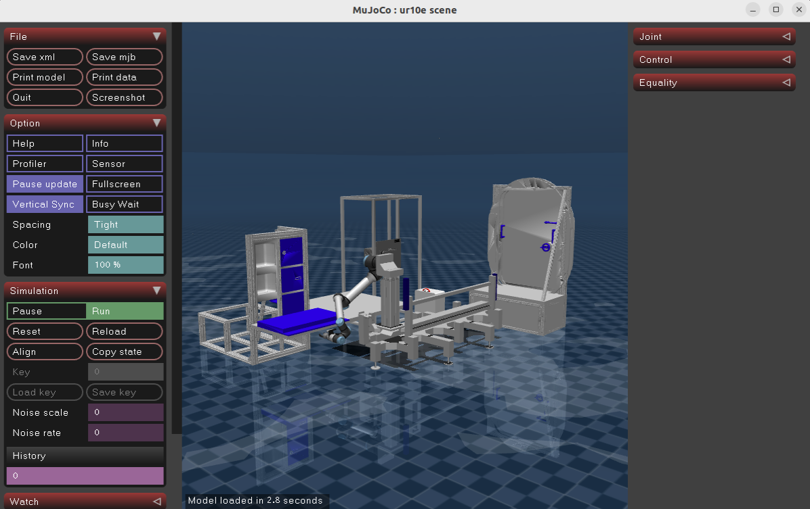

# CLR Sim Demos

This repository contains demonstration applications using the [MuJoCo simulation](https://github.com/NASA-JSC-Robotics/chonkur_l_raile/) of ChonkUR L Rail-E.

This project is intended to be included in an application workspace such as the [clr_dynamic_sim_demo](https://github.com/NASA-JSC-Robotics/clr_dynamic_sim_demo) repository.

## Overview

The examples here, as well as the simulation itself, have been used to trial a sim-to-real pipeline for developing behaviors to run in iMETRO facilities.
These include behaviors requiring color/depth perception, force/torque sensors, or realistic dynamics of the robot in its environment.

As of now there is a single example available for public consumption made with open-source tools:

* [Pick and Place with a CTB](./clr_pick_and_place_demo/README.md)

